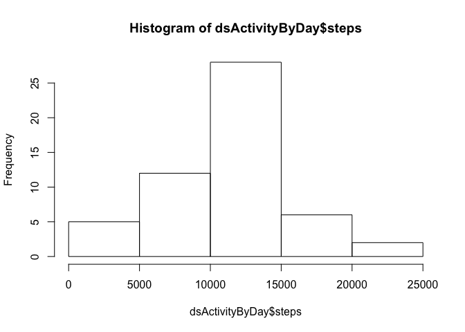

# Reproducible Research: Peer Assessment 1


## Loading and preprocessing the data

First, load the activity monitoring dataset (dsActivity) from the provided file at https://d396qusza40orc.cloudfront.net/repdata%2Fdata%2Factivity.zip.  

For simplicity I assume that the file is located in the current working directory as "activity.csv"


```r
unzip("activity.zip")
dsActivity=read.csv("activity.csv")
```

## What is mean total number of steps taken per day?

Massage the data set to aggregate the step counts by day.  Since the data set includes serveral missing values, and is organised by interval, we create a copy of the dataset (dsActivityByDay) that contains the data aggregated by day, removing duplicates.


```r
dsActivityByDay<-aggregate(steps~date,data=dsActivity,sum,na.action=na.omit)
```

The **mean** total number of steps taken per day is taken as the mean across each day of the daily aggregated steps.


```r
mean(dsActivityByDay$steps)
```

```
## [1] 10766.19
```

The **median** total number of steps taken per day is taken as the median across each day of the daily aggregated steps.


```r
median(dsActivityByDay$steps)
```

```
## [1] 10765
```

A histogram of the steps by day is shown below

```r
hist(dsActivityByDay$steps)
```



## What is the average daily activity pattern?

Next, create a new data set dsActivityByInterval for each interval, aggregating the average number of steps taken across all days (FUN=mean).

```r
dsActivityByInterval <- aggregate(steps ~ interval, data=dsActivity, FUN=mean)
```

We display this daily activity pattern by making a time series plot (i.e. 𝚝𝚢𝚙𝚎 = "𝚕") of the 5-minute interval (x-axis) and the averaged steps (y-axis) taken from the original dsActivity data set.


```r
dsActivityByInterval <- aggregate(steps ~ interval, data=dsActivity, FUN=mean)
plot(dsActivityByInterval, type="l")
```


The 5-minute interval, on average across all the days in the dataset, containing the maximum number of steps is computed by selecting the maximimum interval across $steps.


```r
dsActivityByInterval$interval[which.max(dsActivityByInterval$steps)]
```

```
## [1] 835
```

## Imputing missing values

Missing values may introduce bias into some calculations or summaries of data.
We identify the number of days/intervals where there are missing values by determining the count of any NA records in the original dsActivity data set. 


```r
sum(is.na(dsActivity$steps))
```

```
## [1] 2304
```

Devise a strategy for filling in all of the missing values in the dataset. The strategy does not need to be sophisticated. For example, you could use the mean/median for that day, or the mean for that 5-minute interval, etc.

To reduce bias, we create a new dataset that replaces the NA value with the mean of that interval's steps.  We cannot use the daily values as when a day has NAs it is NA for the entire day.


```r
dsModActivity <- merge(dsActivity, dsActivityByInterval, by="interval", all=TRUE, suffixes=c(".raw",".intavg"))
```

We confirm that we have the same number of NA's post merge


```r
sum(is.na(dsModActivity$steps.raw))
```

```
## [1] 2304
```

Then we replace the NA values with the daily averages.


```r
dsModActivity$steps.raw[is.na(dsModActivity$steps.raw)] <- dsModActivity$steps.intavg[is.na(dsModActivity$steps.raw)]
```

We can confirm that there are no NA records in the new dataset


```r
sum(is.na(dsModActivity$steps.raw))
```

```
## [1] 0
```

We then recreate the activity by day with the new data set.

```r
dsModActivityByDay<-aggregate(steps.raw~date,data=dsModActivity,sum,na.action=na.omit)
```


The **mean** total number of steps taken per day is taken as the mean across each day of the daily aggregated steps.  It remains the same as we added in the interval averages.


```r
mean(dsModActivityByDay$steps.raw)
```

```
## [1] 10766.19
```

```r
identical(mean(dsModActivityByDay$steps.raw),mean(dsActivityByDay$steps))
```

```
## [1] TRUE
```

The **median** total number of steps taken per day is taken as the median across each day of the daily aggregated steps.  It has shifted as we have added in additional daily values.


```r
median(dsModActivityByDay$steps.raw)
```

```
## [1] 10766.19
```

```r
identical(median(dsModActivityByDay$steps.raw),median(dsActivityByDay$steps))
```

```
## [1] FALSE
```

As you can see, the additional values added to replace the missing data has shifted the median and increased the maximum frequency of the histogram by interval.


```r
hist(dsModActivityByDay$steps.raw)
```


## Are there differences in activity patterns between weekdays and weekends?

Add a new factor 'daytype' to the modified data set dsModActivity. daytype has two levels – “weekday” and “weekend” indicating whether a given date is a weekday or weekend day.


```r
dsModActivity$daytype<-factor(ifelse(weekdays(as.Date(dsModActivity$date)) %in% c("Saturday", "Sunday"),"weekend","weekday"))
```

As you can see by the panel plot the profile of steps by interval varies significantly from weekend to weekday.  THe weekend is far more evenly distributed, where the weekday is concentrated around the 800 interval.  

The plots contain a time series plot (i.e. 𝚝𝚢𝚙𝚎 = "𝚕") of the 5-minute interval (x-axis) and the average number of steps taken, averaged across all weekday days or weekend days (y-axis)  The first plot is the weekend.  The second plot is the weekday.


```r
par(mfrow=c(2,1))
plot(aggregate(steps.raw ~ interval, data=dsModActivity,
     subset=dsModActivity$daytype=="weekend", FUN=mean), type="l", main="weekend")
plot(aggregate(steps.raw ~ interval, data=dsModActivity,
     subset=dsModActivity$daytype=="weekday", FUN=mean), type="l", main="weekday")
```


